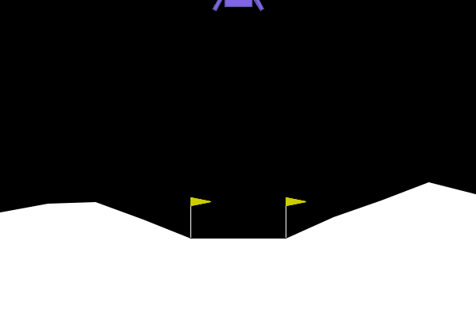

# GymGPT

### ref: 

* https://gymnasium.farama.org/

* https://github.com/Farama-Foundation/Gymnasium

### usage

Run it on video device, such as Macbook, otherwise, you will get error

```
pygame.error: No available video device
```

```
# install swig

# on macbook
brew install swig

# set python environment
virtualenv env
source env/bin/activate
pip install -r requirements.txt
python app.py
```

After running the program, please wait for a moment until the game interface pops up.



